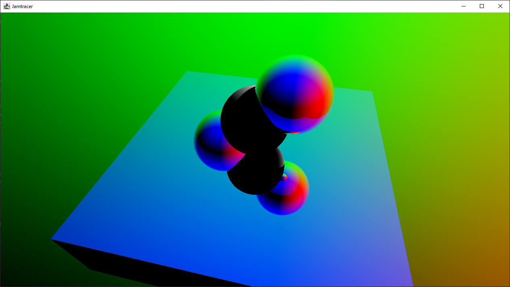

# Jamtracer



A simple raytracer written in Java.

## Features

- Multi-threaded raytracing
- Shadows
- Reflections up to abitrary depth
- Progressive rendering - see your render as it progresses
- Simple shapes: sphere, box
- Different materials per shape

## Requirements

- Maven
- Java 14 with preview features enabled

## Build

Jamtracer can be built with maven:

```sh
mvn clean install
```

Once the build is done, an executable JAR will be created under `target/jamtracer-x.y.z-SNAPSHOT-shaded.jar`

## Usage

Currently Jamtracer doesn't support any command-line arguments, the shaded JAR can be run as-is:

```sh
java --enable-preview -jar target/jamtracer-*-shaded.java
```

## Documentation

Docs can be generated via maven:

```sh
mvn site
```

The generated documents can be found under `target/site/apidocs`.

## License

See [LICENSE](LICENSE).

