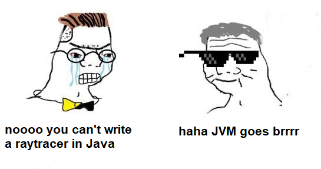
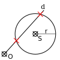
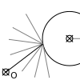
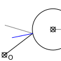
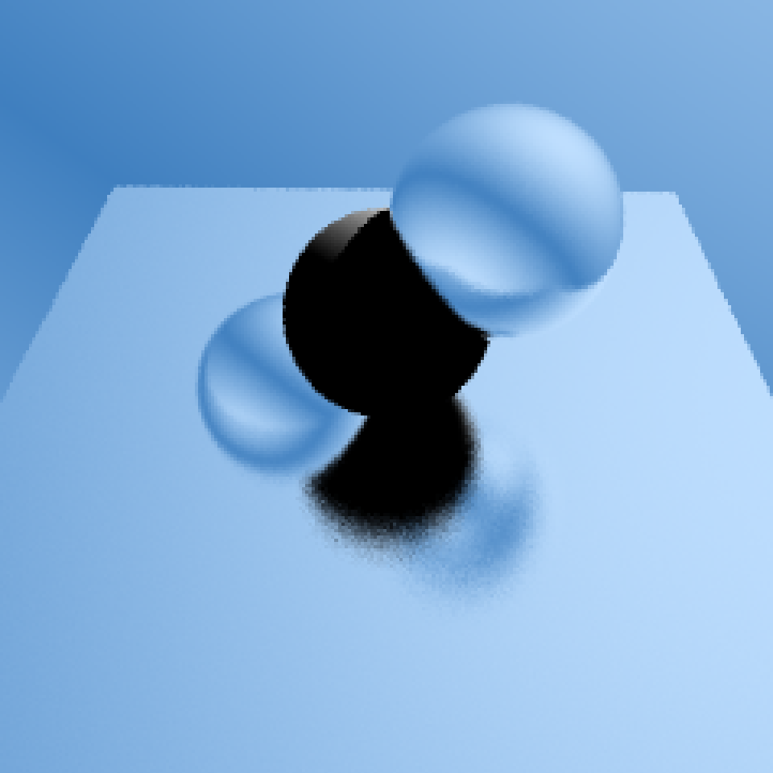

# From rays to shadows

## Raytracing in Java

Gálffy Tamás

---

# Rasterization vs Raytracing

- Rasterization
  - Dali on ungodly amounts of caffeine
  - Very well supported by hardware
  - Smokes and mirrors
- Raytracing
  - Closer to actual physics in approach
  - Hardware support only recently
  - Optical phenomena make more sense with this model

---

# Shadows

- Rasterization has no concept of shadows by default
- Shadow maps are used
  - Scene is rendered from the light's view
  - For each pixel, output the distance from the light
  - For each surface pixel, compare light distance vs. shadow map
  - Simple with directional lights, uncomfortable with point lights
- Runner-up: stencil shadows
- Raytracing: just shoot a ray, see what it hits

---

# Shadow maps

| Scene       | Shadow map | Final image |
| ----------- | ---------- | ----------- |
|  |  |  |

- Images from [Wikipedia](https://en.wikipedia.org/wiki/Shadow_mapping)

---

# Reflections

- No built-in way of modeling reflective surfaces either
- Environment mapping
  - Render surroundings into a texture
  - Sample texture based on reflected direction
  - Works well with planes, cubes and spheres
  - Works just good enough on other objects for us to not notice
- See also: Screen Space Reflections ( still not perfect )
- Raytracing: just shoot a ray, see what it hits

---

# Environment mapping

- Image from [Metal by Example](metalbyexample)

---

# What is raytracing anyways?

- As the name implies, trace rays
- Different kinds
  - Forwards Path Tracing
  - Backwards Path Tracing*
  - Bidirectional Path Tracing

---

# What we'll need

| Helpers    | Domain        |
| ---------- | ------------- |
| Vectors    | Rays          |
| Matrices   | Camera        |
| Transforms | Intersections |
| Colors     | Scene         |
| Displays   | Materials     |

---

# Rays

- Origin
- Direction

---

# Camera

- Cameras provide rays for each pixel
- Perspective camera

---

# Perspective Camera

- Field of view
- Aspect ratio
- If we can figure out *w*, we can interpolate

---

# Perspective camera - finding w

- *f* is FoV/2
- *d* is always 1
- tan(f) = w / d
- tan(f) = w

---

# Ray-sphere intersection

- Analytic approach
- Sphere: ||P - S|| = r^2
- Ray: P = O + d*t
- Substitute ray equation into sphere and see what happens
- The less we care about dimensions, the better

---

# Scene

- Contains all objects to render
- Contains all lights to consider
- Extra: material for scene background
- Gives room for optimization
  - e.g. Octrees, Bounding Volume Hierarchy, Binary Space Tree

---

# Materials

- Describe surface under lighting conditions
- Different phenomena may need different logic
  - plastics, metals, mirrors, glass, etc.

---

# Diffuse materials

- Scatters light in all directions
- Look at your wall
- Shadows need an extra check

---

# Reflective materials

- Reflects light
- Look at your mirror

---

# Extras

- Antialiasing
- Blurry reflections

---

# Q & A

---

# From rays to shadows

## Raytracing in Java

Thank you for your attention!
<https://github.com/elementbound/jamtracer>

